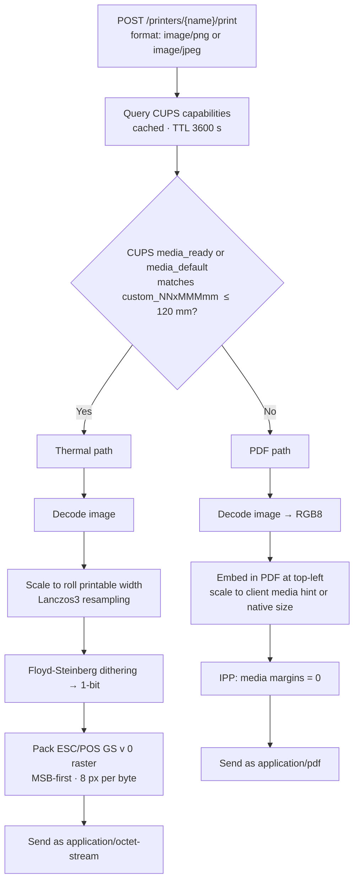

# cups-http-gateway

An HTTP gateway between REST clients and a [CUPS](https://www.cups.org/) print server.
It exposes CUPS over a simple JSON API so any language or platform can send print jobs
without touching IPP directly.

---

## The idea

Most applications need to print but don't want to deal with IPP, CUPS driver quirks, or
thermal printer protocols. The gateway is a **local agent** that lives close to CUPS
(same machine or same VLAN) and exposes a simple JSON API. Your application only needs
HTTP — the gateway handles everything else.


The gateway also handles format translation transparently: PNG/JPEG images are
automatically converted to ESC/POS raster for thermal printers or wrapped in a PDF for
page-based printers — the client never needs to know which type of printer it is talking to.

---

## Use cases

| Scenario | Without this | With this |
|---|---|---|
| Web/SaaS app printing to a customer-site printer | Requires VPN + IPP library per language | HTTP call to the on-site agent |
| Mobile / IoT device sending a print job | No platform IPP support | Any HTTP client |
| Python / JavaScript service printing | No first-class IPP client | Simple `requests.post(...)` |
| Multi-tenant system with printers at each site | Per-site IPP config in your app | Deploy one agent per site, app stays uniform |
| Rust service that only needs printing logic | Must pull in the full HTTP stack | Import the library crate without `http-server` |

---

## API

All responses are JSON. The base URL is `http://<gateway-host>:<port>`.

### Health

```
GET /status
```

```json
{ "ok": true, "version": "0.1.0", "cups": "localhost:631" }
```

### Printers

```
GET  /printers              → list printer names
GET  /printers/:name        → printer state + queued job count
POST /printers/:name/print  → submit a print job
GET  /printers/:name/jobs   → list jobs for a printer
```

#### Print request body

```json
{
  "content": "<plain text or base64-encoded bytes>",
  "format":  "text/plain",
  "job_name": "optional label"
}
```

Supported `format` values: `text/plain`, `application/pdf`, `image/png`, `image/jpeg`,
`application/octet-stream` (or any MIME type your CUPS driver accepts).
For binary formats, `content` must be base64-encoded.

#### Print options

```json
{
  "content": "...",
  "format": "image/png",
  "job_name": "POS Receipt",
  "options": {
    "copies":      1,
    "media":       "custom_80x297mm",
    "sides":       "one-sided",
    "color_mode":  "monochrome",
    "orientation": "portrait"
  }
}
```

| Option | Values | Notes |
| --- | --- | --- |
| `copies` | integer | Number of copies |
| `media` | CUPS media keyword | `iso_a4`, `na_letter`, `custom_80x297mm`, `custom_58x297mm`, etc. |
| `sides` | `one-sided`, `two-sided-long-edge`, `two-sided-short-edge` | |
| `color_mode` | `color`, `monochrome`, `auto` | |
| `orientation` | `portrait`, `landscape`, `reverse-portrait`, `reverse-landscape` | |

Omitted options fall back to the printer's configured CUPS defaults.

#### Print response

```json
{ "ok": true, "job_id": 42 }
```

### curl examples

```bash
# Health check
curl http://localhost:6631/status

# List all printers
curl http://localhost:6631/printers

# Get a specific printer state and queue count
curl http://localhost:6631/printers/HP_LaserJet

# Print plain text
curl -X POST http://localhost:6631/printers/HP_LaserJet/print \
  -H "Content-Type: application/json" \
  -d '{"content": "Hello, world!\n", "format": "text/plain", "job_name": "test"}'

# Print a PDF (base64-encoded)
curl -X POST http://localhost:6631/printers/HP_LaserJet/print \
  -H "Content-Type: application/json" \
  -d "{\"content\": \"$(base64 -i document.pdf)\", \"format\": \"application/pdf\", \"job_name\": \"invoice\"}"

# List jobs for a printer
curl http://localhost:6631/printers/HP_LaserJet/jobs
```

On **Windows PowerShell** use `Invoke-RestMethod`:

```powershell
# Health check
Invoke-RestMethod http://localhost:6631/status

# List printers
Invoke-RestMethod http://localhost:6631/printers

# Print plain text
Invoke-RestMethod http://localhost:6631/printers/HP_LaserJet/print `
  -Method POST `
  -ContentType "application/json" `
  -Body '{"content": "Hello, world!\n", "format": "text/plain", "job_name": "test"}'

# Print a PDF (base64-encoded)
$b64 = [Convert]::ToBase64String([IO.File]::ReadAllBytes("C:\docs\document.pdf"))
Invoke-RestMethod http://localhost:6631/printers/HP_LaserJet/print `
  -Method POST `
  -ContentType "application/json" `
  -Body (@{content=$b64; format="application/pdf"; job_name="invoice"} | ConvertTo-Json)

# List jobs
Invoke-RestMethod http://localhost:6631/printers/HP_LaserJet/jobs
```

---

## Image printing

When the format is `image/png` or `image/jpeg` the gateway never forwards the raw image
to CUPS. It inspects the target printer and chooses one of two paths automatically:



### Thermal path — ESC/POS raster

Activated when CUPS reports a thermal roll as the active media (`media_ready` first,
`media_default` as fallback).

| CUPS media keyword | Roll width | Printable px (203 DPI) |
| --- | --- | --- |
| `custom_80x297mm` | 80 mm | 576 px |
| `custom_58x297mm` | 58 mm | 384 px |
| `custom_76x200mm` (example) | 76 mm | ~548 px |

Any `custom_NNxMMMmm` keyword with N ≤ 120 mm is treated as a thermal roll.
Standard keywords (`na_letter`, `iso_a4`, etc.) always take the PDF path.

The raster conversion:

1. Decodes the PNG/JPEG
2. Scales to the roll's printable width (Lanczos3)
3. Converts to 1-bit greyscale with Floyd-Steinberg dithering
4. Packs into ESC/POS `GS v 0` command (MSB-first, 8 px per byte)

### PDF path — page-based printers

Activated for any printer CUPS does not report as a thermal roll (letter, A4, etc.).

The image is embedded in a PDF sized to the printer's actual media. Scaling uses the
`media` option the client sent as a hint for the intended physical width:

| Client `media` | Target width in PDF |
| --- | --- |
| `custom_80x297mm` | 72 mm (90 % of 80 mm roll) |
| `custom_58x297mm` | 48 mm (90 % of 58 mm roll) |
| Any standard size or omitted | Native 96-DPI size (no upscaling) |

The image is always placed at the top-left corner of the page. The IPP job requests
`media-*-margin = 0` so the content starts from the physical edge of the paper.

### Cases at a glance

| Printer configured in CUPS | Client `media` | Result |
| --- | --- | --- |
| `custom_80x297mm` (80 mm thermal) | anything | ESC/POS 576 px |
| `custom_58x297mm` (58 mm thermal) | anything | ESC/POS 384 px |
| `na_letter` (letter printer) | `custom_80x297mm` | PDF, image at 72 mm, top-left |
| `na_letter` (letter printer) | omitted | PDF, image at native size, top-left |
| `iso_a4` (A4 printer) | omitted | PDF, image at native size, top-left |

> **Thermal printer misconfigured in CUPS as `na_letter`**: the gateway follows what
> CUPS reports. Fix the CUPS media configuration so the gateway can detect it correctly.

---

## Installation

The gateway is a **single self-contained binary** — no runtime, no interpreter, no dependencies.
Pick the method that fits your workflow.

---

### Linux

```bash
# Download and install in one line (x86_64)
curl -sSL https://github.com/Sincpro-SRL/cups-http-gateway/releases/latest/download/cups-http-gateway-linux-x86_64.tar.gz \
  | sudo tar -xz -C /usr/local/bin

# Verify
cups-http-gateway --version
```

```bash
# ARM64 (e.g. Raspberry Pi, AWS Graviton)
curl -sSL https://github.com/Sincpro-SRL/cups-http-gateway/releases/latest/download/cups-http-gateway-linux-aarch64.tar.gz \
  | sudo tar -xz -C /usr/local/bin
```

---

### macOS

```bash
# Apple Silicon (M1 / M2 / M3)
curl -sSL https://github.com/Sincpro-SRL/cups-http-gateway/releases/latest/download/cups-http-gateway-macos-arm64.tar.gz \
  | tar -xz -C /usr/local/bin

# Intel
curl -sSL https://github.com/Sincpro-SRL/cups-http-gateway/releases/latest/download/cups-http-gateway-macos-x86_64.tar.gz \
  | tar -xz -C /usr/local/bin

# Verify
cups-http-gateway --version
```

> macOS may quarantine the binary on first run. Clear it with:
> `xattr -d com.apple.quarantine /usr/local/bin/cups-http-gateway`

---

### Windows

Open **PowerShell as Administrator**:

```powershell
# Download
$url  = "https://github.com/Sincpro-SRL/cups-http-gateway/releases/latest/download/cups-http-gateway-windows-x86_64.zip"
$dest = "$env:ProgramFiles\cups-http-gateway"

New-Item -ItemType Directory -Force $dest | Out-Null
Invoke-WebRequest -Uri $url -OutFile "$env:TEMP\cups-http-gateway.zip"
Expand-Archive -Path "$env:TEMP\cups-http-gateway.zip" -DestinationPath $dest -Force

# Add to PATH for this session (or add permanently via System Properties)
$env:PATH += ";$dest"

# Verify
cups-http-gateway --version
```

To make the PATH change permanent across sessions:

```powershell
[System.Environment]::SetEnvironmentVariable(
  "PATH",
  $env:PATH + ";$env:ProgramFiles\cups-http-gateway",
  [System.EnvironmentVariableTarget]::Machine
)
```

---

### Via cargo (requires Rust toolchain)

```bash
cargo install cups-http-gateway
```

---

### From source

```bash
git clone https://github.com/Sincpro-SRL/cups-http-gateway
cd cups-http-gateway
cargo build --release
# Linux / macOS: target/release/cups-http-gateway
# Windows:       target\release\cups-http-gateway.exe
```

---

## Running

```
cups-http-gateway [OPTIONS]

Options:
  --host       <HOST>       Gateway bind address  [default: 0.0.0.0]
  --port       <PORT>       Gateway HTTP port     [default: 6631]
  --cups-host  <CUPS_HOST>  CUPS server hostname  [default: localhost]
  --cups-port  <CUPS_PORT>  CUPS IPP port         [default: 631]
  --log-level  <LEVEL>      Tracing level         [default: info]
  -h, --help                Print help
  -V, --version             Print version
```

### Linux / macOS

```bash
# CUPS is on the same machine (most common)
cups-http-gateway

# CUPS is on another host in the network
cups-http-gateway --cups-host 192.168.1.50 --cups-port 631

# Custom gateway port + verbose logs
cups-http-gateway --port 8080 --log-level debug

# Bind only to localhost (don't expose outside this machine)
cups-http-gateway --host 127.0.0.1 --port 6631
```

### Windows (PowerShell)

```powershell
# CUPS is on another host in the network (Windows has no native CUPS)
cups-http-gateway --cups-host 192.168.1.50 --cups-port 631

# Custom port
cups-http-gateway --cups-host 192.168.1.50 --port 8080 --log-level debug
```

### Verify it is running

```bash
curl http://localhost:6631/status
# {"ok":true,"version":"0.1.0","cups":"localhost:631"}

curl http://localhost:6631/printers
# {"printers":["HP_LaserJet","Brother_HL"]}
```

---

## Deployment

The gateway is a single self-contained binary — no runtime, no interpreter, no dependencies.
Copy it to the target machine and register it with the OS service manager.

### Linux — systemd

```bash
# 1. Install the binary
sudo install -m 755 cups-http-gateway /usr/local/bin/cups-http-gateway

# 2. Create a dedicated system user (optional but recommended)
sudo useradd --system --no-create-home cups-gateway
```

```ini
# /etc/systemd/system/cups-http-gateway.service
[Unit]
Description=CUPS HTTP Gateway
Documentation=https://github.com/Sincpro-SRL/cups-http-gateway
After=network.target cups.service

[Service]
User=cups-gateway
ExecStart=/usr/local/bin/cups-http-gateway \
    --cups-host localhost \
    --cups-port 631 \
    --host 0.0.0.0 \
    --port 6631
Restart=on-failure
RestartSec=5

[Install]
WantedBy=multi-user.target
```

```bash
# 3. Enable and start
sudo systemctl daemon-reload
sudo systemctl enable --now cups-http-gateway

# Useful commands
sudo systemctl status cups-http-gateway
sudo journalctl -u cups-http-gateway -f
```

---

### macOS — launchd

CUPS ships with macOS out of the box. The gateway runs as a system daemon via launchd.

```bash
# 1. Install the binary
sudo install -m 755 cups-http-gateway /usr/local/bin/cups-http-gateway
```

```xml
<!-- /Library/LaunchDaemons/com.sincpro.cups-http-gateway.plist -->
<?xml version="1.0" encoding="UTF-8"?>
<!DOCTYPE plist PUBLIC "-//Apple//DTD PLIST 1.0//EN"
  "http://www.apple.com/DTDs/PropertyList-1.0.dtd">
<plist version="1.0">
<dict>
  <key>Label</key>
  <string>com.sincpro.cups-http-gateway</string>

  <key>ProgramArguments</key>
  <array>
    <string>/usr/local/bin/cups-http-gateway</string>
    <string>--cups-host</string>  <string>localhost</string>
    <string>--cups-port</string>  <string>631</string>
    <string>--host</string>       <string>0.0.0.0</string>
    <string>--port</string>       <string>6631</string>
  </array>

  <key>RunAtLoad</key>       <true/>
  <key>KeepAlive</key>       <true/>
  <key>StandardOutPath</key> <string>/var/log/cups-http-gateway.log</string>
  <key>StandardErrorPath</key><string>/var/log/cups-http-gateway.log</string>
</dict>
</plist>
```

```bash
# 2. Load and start
sudo launchctl load -w /Library/LaunchDaemons/com.sincpro.cups-http-gateway.plist

# Useful commands
sudo launchctl list | grep cups-gateway
tail -f /var/log/cups-http-gateway.log

# Stop / unload
sudo launchctl unload /Library/LaunchDaemons/com.sincpro.cups-http-gateway.plist
```

> **User-level daemon**: if you want it to run only for your user (without sudo),
> place the plist under `~/Library/LaunchAgents/` and use `launchctl load` without `sudo`.

---

### Windows — Windows Service (NSSM)

On Windows the gateway connects to a CUPS server running elsewhere on the network
(CUPS is not native to Windows). Use [NSSM](https://nssm.cc/) to wrap the binary as a
Windows Service.

```powershell
# 1. Download NSSM and place nssm.exe in the PATH, then:

# 2. Copy the binary
New-Item -ItemType Directory -Force "C:\Program Files\cups-http-gateway"
Copy-Item cups-http-gateway.exe "C:\Program Files\cups-http-gateway\"

# 3. Register as a Windows Service
nssm install cups-http-gateway "C:\Program Files\cups-http-gateway\cups-http-gateway.exe"
nssm set cups-http-gateway AppParameters `
    "--cups-host 192.168.1.50 --cups-port 631 --host 0.0.0.0 --port 6631"
nssm set cups-http-gateway AppStdout "C:\Logs\cups-http-gateway.log"
nssm set cups-http-gateway AppStderr "C:\Logs\cups-http-gateway.log"
nssm set cups-http-gateway Start SERVICE_AUTO_START

# 4. Start
nssm start cups-http-gateway
```

```powershell
# Useful commands
nssm status cups-http-gateway
nssm restart cups-http-gateway
nssm remove cups-http-gateway confirm
```

> **Without NSSM**: you can also register the service with the native `sc.exe`, but NSSM
> handles stdout/stderr logging and auto-restart more conveniently for a single binary.

---

## Using as a library (no HTTP)

The crate ships a library that exposes the domain and service layer without the HTTP stack.
This is useful when you want to embed printing logic directly in your own Rust service.

```toml
# Cargo.toml
[dependencies]
cups-http-gateway = { version = "0.1", default-features = false }
```

```rust
use cups_http_gateway::services::printer_service::PrinterService;
use cups_http_gateway::adapters::cups::client::CupsClient;

let client = CupsClient::new("localhost", 631);
let service = PrinterService::new(client);

let printers = service.list_printers().await?;
service.print("my-printer", content_bytes, "application/pdf", None).await?;
```

The `http-server` feature (enabled by default) adds axum, tower-http, clap, and
tracing-subscriber. Disabling it gives you a smaller dependency tree with only the
IPP adapter and service layer.

---

## Configuration (roadmap)

Currently the gateway is configured entirely through CLI arguments. Planned additions:

- **Config file** (`cups-gateway.toml`) for persistent configuration without shell flags,
  useful for systemd or Docker deployments where you prefer a file over a long command line.
- **Runtime CUPS target switching** — an HTTP endpoint to point the gateway at a different
  CUPS server without restarting, for multi-CUPS environments.

---

## License

MIT
